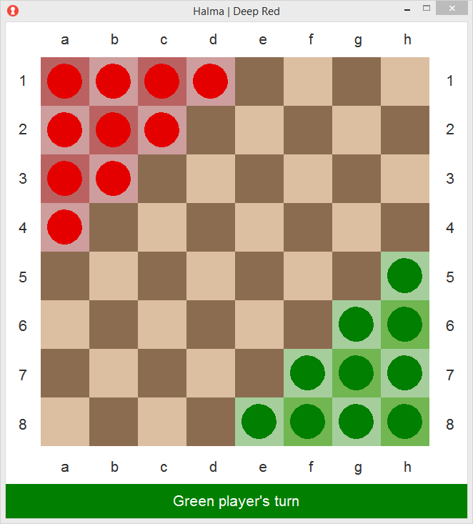
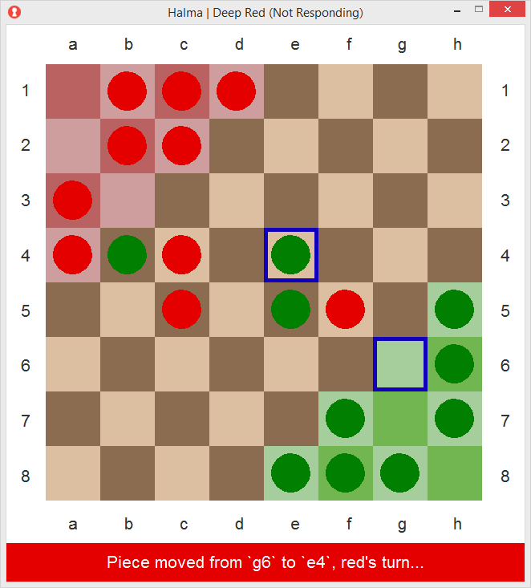
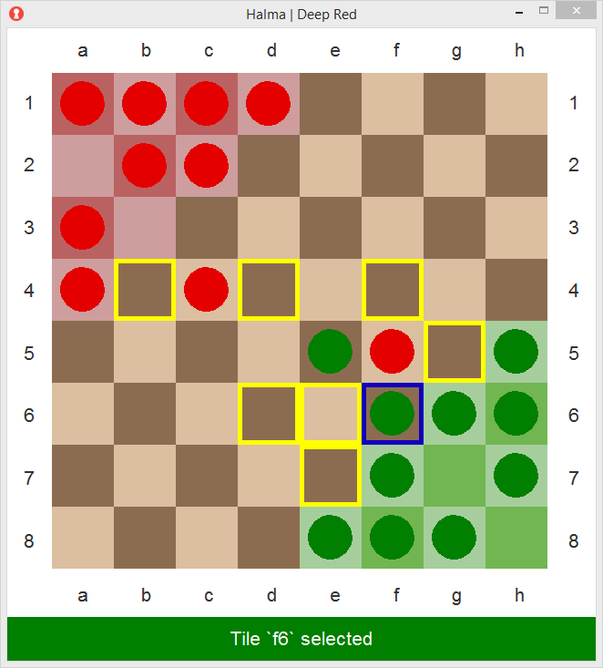

#  Halma AI

An AI that uses an adversarial minimax search with alpha-beta purning to
determine the best subsequent move. The program also supports player vs.
player games.

`usage: halma <b-size> <t-limit> [<h-player>]`

## Game Images

## Class Tournament

The final project for this course was structured around creating this
adversarial AI so that the teams in class could compete in one final tournament
on the last day of class.

Our AI worked its way through 4 games of this single-elimination tournament to
win first place.

## Additional Notes

* The move-finding method is under the assumption that pieces cannot re-enter
friendly goals or leave enemy goals even during a jump chain.
* Computation is currently fixed to a ply-depth of 3 rather than using
dynamic depth.
* Turn time exhaustion will simply break the recursion with its current max.

## Team Info

* Peter Huettl - [ph289@nau.edu](ph289@nau.edu)
* Garrison Smith - [gts35@nau.edu](gts35@nau.edu)
